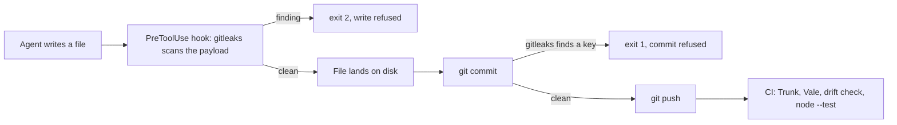

# public-agent-provisioning

**One folder that provisions seven AI coding agents with rules, skills, tools,
and guardrails—and every moving part is owned by maintained software, not by
you.**

Fork this repository, run four commands, and Claude Code, Codex CLI, Cursor,
GitHub Copilot, Cline, OpenCode, and anything that reads the plain `AGENTS.md`
standard all wake up with the same operating rules, 36 skills, two MCP tool
servers—MCP is the Model Context Protocol, the standard by which an agent
calls external programs, here one that drives Chrome and one that edits Office
files—a hook that refuses to write a credential into a file, and git hooks
that refuse to commit or push one.

This repository contains **zero hand-rolled code**. Nothing here detects a
secret, parses a payload, or installs a git hook. `gitleaks` detects, Trunk
installs, `rulesync` writes the agent config, and the pinned community skill
packages are fetched from their own repositories. What lives here is
configuration, documentation, and the tests that prove the configuration still
refuses things.

## The layers

| Layer | Maintained owner | Fires | You edit |
|---|---|---|---|
| Rules, read every turn | `rulesync` 16.14.0 | every turn, unconditionally | `.rulesync/rules/overview.md` |
| Skills, read on demand | `rulesync`, pinned to three upstream skill packages | when a conversation matches a skill description | `rulesync.jsonc` (`sources`), `.rulesync/skills/` |
| MCP tool servers | `rulesync` registers them; Google and iOfficeAI ship them | when the agent reaches for a browser or an Office file | `.rulesync/mcp.jsonc` |
| Tool-call hook | `rulesync` registers it; the command IS `gitleaks` 8.30.1 | the instant before a file write runs | `.rulesync/hooks.jsonc` |
| Git guards | Trunk 1.25.0 | on `git commit` and `git push` | `.trunk/trunk.yaml` |
| Self-checks | `node:test`, Node standard library | on demand and on every pull request | `tests/` |

Rules, skills, and MCP servers are what an agent reads and reaches for. The
hook, the git guards, and the self-checks are what stop it whether or not it
read them.



## Quickstart

Three tools, each a one-line install:

| Tool | Windows | macOS | Linux |
|---|---|---|---|
| `git` | usually present | usually present | usually present |
| Node 22 or later | `winget install OpenJS.NodeJS.LTS` | `brew install node` | your package manager |
| `gitleaks` | `winget install Gitleaks.Gitleaks` | `brew install gitleaks` | single binary from [releases](https://github.com/gitleaks/gitleaks/releases) |

Then:

```bash
git clone https://github.com/<your-fork>/public-agent-provisioning.git
cd public-agent-provisioning
npm install                # rulesync and the Trunk launcher, the only two dependencies
npx rulesync install       # fetch the 34 pinned community skills (rulesync.lock decides the versions)
npx trunk git-hooks sync   # Trunk writes the pre-commit and pre-push hooks
```

Open the folder with any of the seven agents and it is provisioned. Nothing
else to configure: the generated files are committed, so the agents work even
before the commands above finish—the commands make the guards and skill
sources live on your machine.

If `npx rulesync install` hits a GitHub rate limit, give it a token—with the
GitHub CLI that is `GITHUB_TOKEN=$(gh auth token) npx rulesync install`, and
without it any personal access token in `GITHUB_TOKEN` works.

### Prove the guards, both of them

On Windows, run these blocks in Git Bash, which installs with git; they use
shell syntax PowerShell does not speak.

Try to commit a credential. The fake key is assembled from three fragments at
run time, so the twenty character string never sits in this file and this
README does not trip the repository's own scanner.

```bash
printf 'aws_access_key_id = %s%s%s\n' AKIA 3XQZP7RB 2NLKWJ4C > leak.md
git add leak.md
git commit -m "quickstart proof"
```

The commit is refused, `HEAD` does not move, and `leak.md` stays staged so no
work is destroyed.

```text
leak.md:1:21
 1:21  high  aws-access-token has detected secret for file leak.md.

Checked 1 modified file
1 new lint issue
Commit blocked by git hook 'block-commit-on-findings'
```

Clean up before doing anything real.

```bash
git restore --staged leak.md
rm leak.md
```

The same scanner sits in front of the agent's own file writes, one step before
git ever sees the content—and it is not a script, it is `gitleaks` itself,
reading the tool call's JSON payload from stdin. Feed it the payload an agent
host sends and read the exit code:

```bash
printf '{"tool_name":"Write","tool_input":{"file_path":"leak.md","content":"aws_access_key_id = %s%s%s"}}' \
  AKIA 3XQZP7RB 2NLKWJ4C | gitleaks stdin -v --no-color --no-banner --redact --exit-code 2 1>&2
echo "exit $?"
```

```text
Finding:     REDACTED
Secret:      REDACTED
RuleID:      aws-access-token
Entropy:     4.121928
...
exit 2
```

The elided lines are gitleaks' own timestamped log output—scan size and
`leaks found: 1`—which vary run to run.

Exit code 2 is the only value an agent host reads as `stop, do not run this
tool call`. The finding names the rule and never the secret, because that
message goes back into the agent's own transcript.

## What you get, and what you fill in

| | Count | Where |
|---|---|---|
| Agent config files written for you | 855, across 7 agents | root `AGENTS.md`, `CLAUDE.md`, `.mcp.json`, and `opencode.jsonc`, plus `.claude/`, `.cursor/`, `.codex/`, `.cline/`, `.clinerules/`, `.opencode/`, `.agents/`, `.vscode/`, and `.github/`—where `.github/workflows/ci.yml` is the one hand-written file among generated neighbours |
| Source files that produce all 855 | 7 | `rulesync.jsonc` plus `.rulesync/` |
| Community skills, pinned and locked | 34 from 3 upstream packages | `rulesync.jsonc` (`sources`), `rulesync.lock` |
| MCP tool servers | 2 | `.rulesync/mcp.jsonc` |
| Guard code you own and maintain | **0 lines** |—|
| Lines you are expected to change | 7, tagged **default**, carrying 9 values | `.rulesync/rules/overview.md` |
| Example skills to replace with real ones | 2 | `.rulesync/skills/` |
| Self-checks that run on every pull request | 24 | `tests/` |

The seven agents are Claude Code, OpenAI Codex CLI, Cursor, GitHub Copilot,
Cline, `opencode`, and anything that reads the plain `AGENTS.md` standard.

Editing a generated file by hand is the one banned move. The `--check` mode of
`rulesync` regenerates in memory, compares, and exits 1 on any change in
meaning. The `generated-files-match-source` job in `.github/workflows/ci.yml`
runs it on every pull request.

## The MCP servers

Two tool servers, declared once in `.rulesync/mcp.jsonc` and written into each
agent's native format. Both launch through `npx`, so the only prerequisite is
Node; the first cold start of each downloads its package.

- **[`chrome-devtools-mcp`](https://github.com/ChromeDevTools/chrome-devtools-mcp)**,
  by the Chrome DevTools team. The agent drives a real Chrome: navigate,
  click, fill forms, take screenshots, read the console and the network.
  Needs Chrome installed. Google collects usage statistics by default; add
  `--no-usage-statistics` to its `args` entry to opt out.
- **[OfficeCLI](https://github.com/iOfficeAI/OfficeCLI)**, by iOfficeAI,
  Apache-2.0. The agent reads and edits `.docx`, `.xlsx`, and `.pptx` files
  with no Microsoft Office installed. The npm package is the scoped
  `@officecli/officecli`; the unscoped `officecli` on npm is an unrelated
  project.

Cline is the one agent that gets no MCP entry from this repository: rulesync
can only write Cline's MCP settings into your home directory, not into a
repository. Run `npx rulesync generate --global --features mcp --targets cline`
yourself if you use Cline and want the servers.

## The skills

34 community skills arrive from three pinned sources, listed skill-by-skill in
`rulesync.jsonc`:

- **[`addyosmani/agent-skills`](https://github.com/addyosmani/agent-skills)**
  (MIT): 24 general engineering skills—test-driven development, debugging
  and error recovery, security and hardening, code review, performance,
  planning, and the rest.
- **[`anthropics/skills`](https://github.com/anthropics/skills)** (Apache-2.0
  per skill): `skill-creator`, `mcp-builder`, `claude-api`, `webapp-testing`,
  `frontend-design`.
- **[`vale-cli/agent-tools`](https://github.com/vale-cli/agent-tools)** (MIT,
  Vale's own org): the skills that let an agent set up and run Vale instead of
  guessing at prose style.

`npx rulesync install` resolves each pin to a commit and records per-skill
integrity hashes in `rulesync.lock`, which is committed. CI installs with
`--frozen`, so what a fork gets is byte-for-byte what the lockfile names. Bump
everything with `npx rulesync install --update`, then read the diff before
committing it.

The two skills under `.rulesync/skills/` are worked examples meant to be
replaced with your own.

## Fork it

1. Use this repository as a template, not a submodule. There is no upstream to
   track and no version to pin.
2. Rewrite the seven lines tagged **default** in `.rulesync/rules/overview.md`.
   They carry nine values, because two of the lines carry two figures each.
   Line budgets, the search order for prior art, and the validation libraries
   are starting positions, not law.
3. Replace the two example skills with your own, then run
   `npx rulesync generate --delete` so the old generated copies go away rather
   than lingering where agents keep reading them.
4. Prune the skill lists in `rulesync.jsonc` to your stack—a frontend-less
   service does not need `frontend-ui-engineering`—and re-run
   `npx rulesync install && npx rulesync generate --delete`.
5. Add or remove MCP servers in `.rulesync/mcp.jsonc`. A server you can launch
   from a command line is one `command`/`args` entry away from every agent.
6. Loosen `.rulesync/permissions.jsonc`. The `bash` catch-all is `ask`, which is
   deliberately annoying on a first run. Add `allow` entries for the commands
   your stack runs constantly instead of flipping the catch-all.
7. Run `npm run verify` before you trust any of it. That is
   `rulesync install --frozen`, then `rulesync generate --check`, then
   `trunk check --all`, then `vale .`, then `node --test`.

## A maintained tool is not automatically a gate

The self-check tier caught a real defect on its first run, in the wiring rather
than in anybody's code.

Trunk's stock pre-commit actions are declared `interactive: optional`. That
includes `trufflehog-pre-commit`, whose own description reads `Don't allow
secrets in commits`. They find the secret, print it, and then ask
`Changes not currently passing checks. Continue anyway? (Y/n)`.

With no terminal attached, the prompt answers itself, and the commit lands. No
terminal attached describes every AI agent, every CI runner, and every editor
that commits on your behalf.

Reproduced on 2026-08-22 in a scratch repository running the stock
`trunk-check-pre-commit` action with `gitleaks` enabled. `gitleaks` reported
`aws-access-token has detected secret for file leak.md`, Trunk printed the
prompt, `git commit` exited 0, `HEAD` moved, and the key is in the committed
blob.

The fix is six lines in `.trunk/trunk.yaml`, a custom action running
`trunk check --ci`, which never prompts and exits non-zero on a finding. Both
stock actions stay off.

Adopting a maintained tool is the start of the job rather than the end of it,
because a good tool's default configuration can still be a warning wearing a
gate's name. The self-check tier is what tells you which one you got.

## What this replaced

This repository has deleted its own code twice.

The first version shipped 3,649 lines of hand-written enforcement: a 690-line
Python hook layer with 16 hand-written secret patterns, 504 lines of bash git
hooks plus a 502-line installer, and a 152-line hand-rolled test runner. The
rebuild deleted all of it in favour of `rulesync`, `gitleaks`, Trunk, and
`node:test`, leaving one owned file: a 66-line Node wrapper that unwrapped the
hook payload and handed the text to `gitleaks`.

Then the wrapper went too. `gitleaks stdin` reads the raw JSON payload
directly, its rules match the credential straight through the JSON escaping,
and `--exit-code 2` speaks the hook contract without translation—verified
against every tool in the matcher on 2026-08-23. The wrapper existed to pull
four content fields out of the payload, and it shipped one silent bug doing it:
`NotebookEdit` sat in its matcher while the script never read that tool's
payload key, so every notebook write was allowed through until an adversarial
test caught it. A scan that never selects fields cannot repeat that bug.

| Layer | First version | Second version | Now |
|---|---|---|---|
| Rules | one hand-written `AGENTS.md`, 8 unresolved placeholders | `rulesync` writes 30 files from 5 sources | `rulesync` writes 855 files from 7 sources |
| Skills | a folder no agent harness ever read | 2 examples | 34 pinned community skills + 2 examples |
| MCP tools | none | none | 2 vendor-shipped servers |
| Tool-call hook | 690 lines of Python | 66 lines of Node shelling to `gitleaks` | one line of config: `gitleaks` is the command |
| Git guards | 504 lines of bash + 502-line installer | `trunk git-hooks sync` | `trunk git-hooks sync` |
| Self-checks | 152-line hand-rolled runner | `node:test`, zero test dependencies | `node:test`, zero test dependencies |

Executable guard logic went from 1,194 lines to 66 to **0**.

## Prior art

Agent guardrails already exist and several are good. `PRIOR-ART.md` lists what
each project is for, which of them this repository now depends on, and the live
star counts and last-push dates behind those calls.

## Design decisions

`SPEC.md` states the decisions that are locked, the escape hatches that
actually exist, the fail-open trade the hook makes and what covers it, and the
things this repository is not.

## License

MIT for this repository, see `LICENSE`. The community skills stay under their
upstream licenses: `addyosmani/agent-skills` and `vale-cli/agent-tools` are
MIT, and each pinned `anthropics/skills` skill ships its own Apache-2.0
`LICENSE.txt`, which the generated copies include. The MIT license texts for
the other two sources are not inside the copied skill folders—rulesync
copies each skill's files as upstream lays them out, and upstream keeps the
license at the repository root—so `rulesync.lock` records the exact upstream
commit each skill came from, and this paragraph is the attribution pointing at
them.
